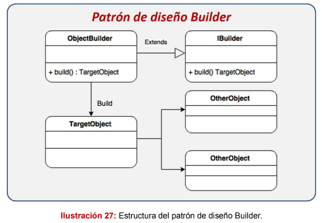
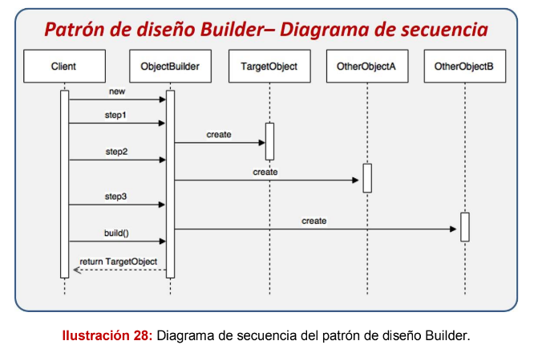
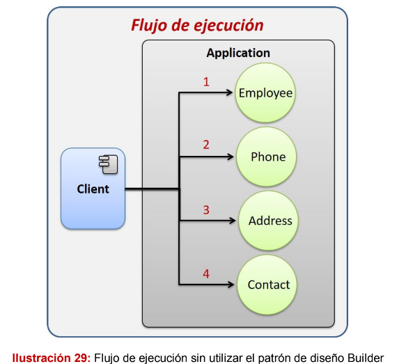
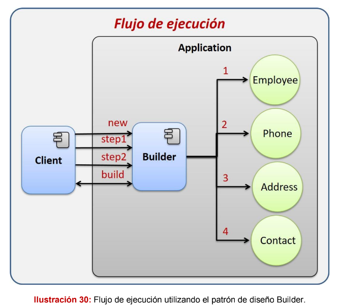
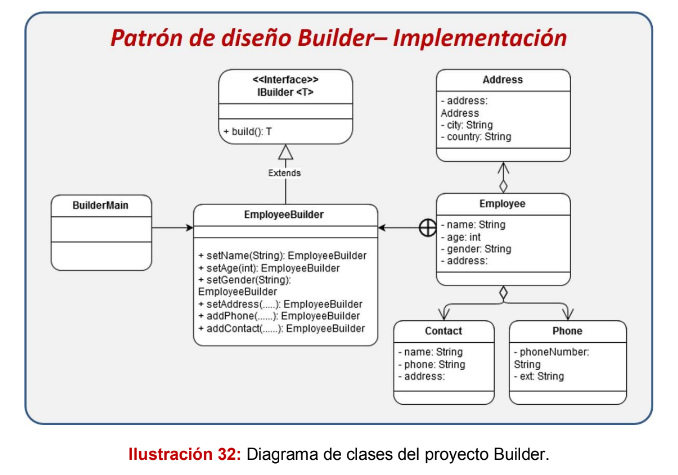

# Patrón Builder
Este es un patrón bastante simple, pero muy útil, que permite crear objetos
complejos a través de uno más simple.

## Diagrama de secuencia del patrón Builder

El diagrama se interpreta de la siguiente manera:
- El cliente crea una instancia del ObjectBuilder.
- El cliente ejecuta el paso 1 de la creación en el ObjectBuilder.
- Internamente el ObjectBuilder crea al TargetObject.
- El cliente ejecuta el paso 2 de la creación en el ObjectBuilder.

- Internamente el ObjectBuileder crea un OtherObjectA.
- El cliente ejecuta el paso 3 de la creación en el ObjectBuilder.
- Internamente el ObjectBuilder crear el OtherObjectB.
- El cliente solicita al ObjectBuilder la creación del TargetObject, éste toma
todos los objetos creados anteriormente, los asocia al TargetObject y lo
regresa.

## Utilizarlo cuando:
- Cuando necesitamos un mecanismo simple para crear objetos complejos.
- Cuando necesitamos crear repetidamente objetos complejos. 
- Cuando necesitamos ocultar a los usuarios la complejidad de la creación
de un objeto determinado.

## El escenario:
Para comprender mejor cómo funciona el patrón, realizaremos un ejemplo clásico,
donde es necesario crear la estructura completa de un empleado, el cual puede
tener una dirección, uno o varios teléfonos y varios contactos; además de los
datos básicos como su nombre, edad y género.

En este caso, sin el patrón builder, el Cliente  se debe encargar de crear cada objeto en un órden específico, ya que algunos objetos dependen de otros para su creación.

## Implementación

